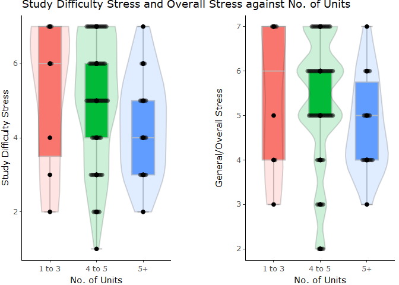
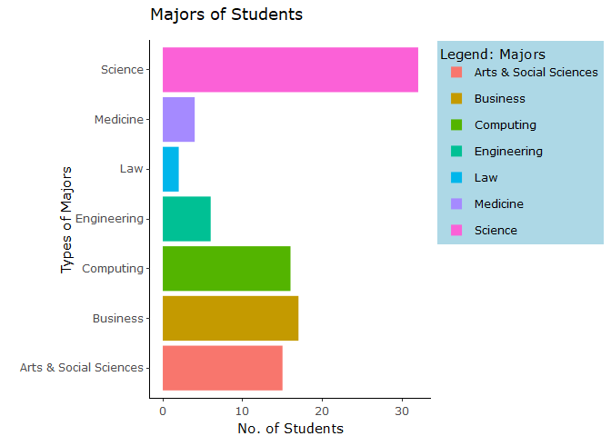
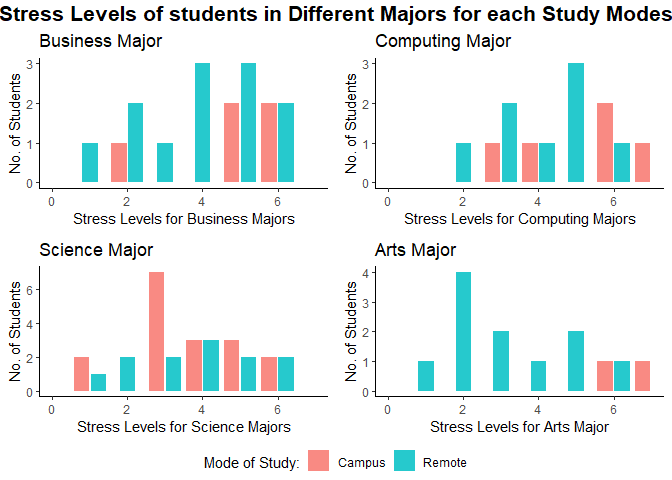
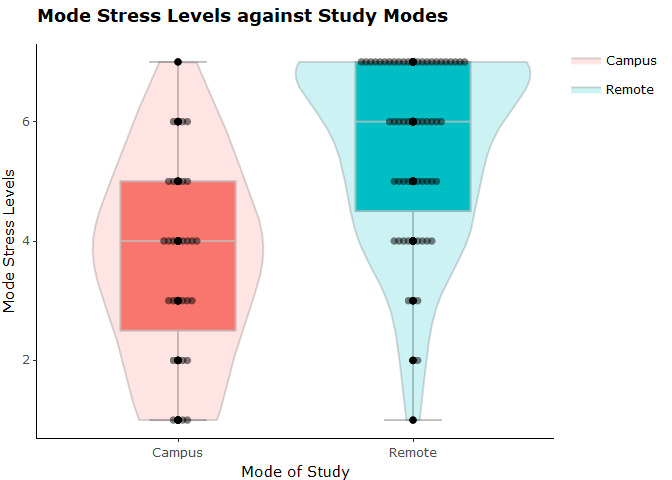
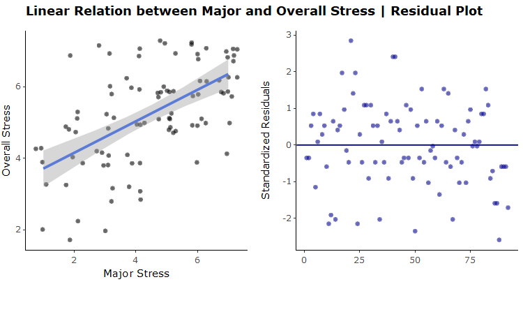
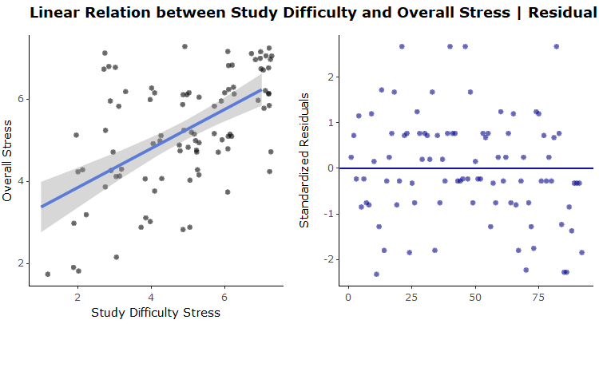

``` r
library(ggplot2)
library(ggbeeswarm)
library(plotly)
library(ggpubr)
theme_set(theme_classic())
```

``` r
# Read in your survey data
stress_data <- read.csv("Stress - Form Responses.csv", na.strings=c("","NA"))
stress_data$Gender <- factor(stress_data$Gender)
stress_data$Age <- factor(stress_data$Age)
stress_data$Country <- factor(stress_data$Country)
stress_data$Major <- factor(stress_data$Major)
stress_data$StudyMode <- factor(stress_data$StudyMode)
stress_data$NumUnits <- factor(stress_data$NumUnits)
```

<br>

# Executive Summary

The report examines the relationship between the stress levels amongst
university students and the contributory factors. The data suggests an
unexpected negative trend between the number of study units and overall
stress levels. Additionally, the difficulty of units and the student’s
majors have the highest correlation to the stress levels.

# Full Report

## Initial Data Analysis (IDA)

### Limitations:

The following highlights two of the experiment’s limitations:

-   Majors:  
    Asking participants if their major is a source of stress causes
    implicit bias from the students. Differing majors and increased
    stress levels, in contrast to others, is based on an uneven data
    pool. Primary access was for DATA1001, causing a disproportionate
    amount of Science students. Future experiments could aim to
    standardize students from every faculty.

-   Selection Bias:  
    The questionnaire was posted on Ed Forum; resulting in higher
    Science Faculty participants. Consequently, (Q1) results are
    misrepresented.

-   Stressors:  
    Including more stressors and their effects could widen the scope of
    the investigation and aid in determining what the main source of
    stress amongst students could be.

### Statistical Thinking:

The experiment was aimed at deconstructing the concept of stress and
producing a report by inferential statistics. The questionnaires
gathered quantitative and qualitative data. The deconstruction of stress
into simple terms required forming an effective questionnaire and scale.

The Likert scale (1-7) facilitated representing abstract emotions into
numerical data. Furthermore, using a psychometric scale enables
effective standardization of data used in graphs. In addition, the range
increased the accuracy of the participants’ stress levels.

### Source:

Data was collected from participants on a Google Form:
[Link](https://forms.gle/hrbqvdv2mvdRWjPf7)

### Structure:

``` r
str(stress_data)
```

    ## 'data.frame':    92 obs. of  12 variables:
    ##  $ Gender          : Factor w/ 3 levels "Female","Male",..: 1 1 1 1 1 2 1 1 1 1 ...
    ##  $ Age             : Factor w/ 13 levels "16","17","18",..: 5 5 4 4 4 6 3 5 3 3 ...
    ##  $ GeneralStress   : int  6 6 6 5 3 6 5 4 6 4 ...
    ##  $ Country         : Factor w/ 13 levels "Australia","Bangladesh",..: 5 2 5 5 5 5 5 5 5 5 ...
    ##  $ CulturalStress  : int  5 2 2 2 4 7 3 4 4 3 ...
    ##  $ Major           : Factor w/ 7 levels "Arts & Social Sciences",..: 1 1 1 1 1 1 1 1 1 1 ...
    ##  $ MajorStress     : int  7 7 5 2 2 6 2 1 5 3 ...
    ##  $ NumUnits        : Factor w/ 3 levels "1 to 3","4 to 5",..: 3 2 2 2 1 3 3 1 3 2 ...
    ##  $ UnitStress      : int  7 6 7 4 2 6 7 1 6 3 ...
    ##  $ DifficultyStress: int  6 5 7 2 2 7 6 4 4 2 ...
    ##  $ StudyMode       : Factor w/ 2 levels "Campus","Remote": 2 2 2 2 2 2 2 2 2 2 ...
    ##  $ ModeStress      : int  6 6 7 3 6 7 7 7 6 4 ...

``` r
summary(stress_data)
```

    ##         Gender        Age     GeneralStress         Country   CulturalStress 
    ##  Female    :52   18     :34   Min.   :2.000   India     :35   Min.   :1.000  
    ##  Male      :30   19     :24   1st Qu.:4.000   Australia :19   1st Qu.:2.000  
    ##  Non-binary: 1   20     :13   Median :5.000   Bangladesh:17   Median :4.000  
    ##  NA's      : 9   21     : 6   Mean   :5.217   China     : 4   Mean   :3.739  
    ##                  26     : 5   3rd Qu.:6.000   Singapore : 4   3rd Qu.:5.000  
    ##                  22     : 2   Max.   :7.000   Uk        : 3   Max.   :7.000  
    ##                  (Other): 8                   (Other)   :10                  
    ##                     Major     MajorStress      NumUnits    UnitStress   
    ##  Arts & Social Sciences:15   Min.   :1.000   1 to 3: 8   Min.   :1.000  
    ##  Business              :17   1st Qu.:3.000   4 to 5:65   1st Qu.:4.750  
    ##  Computing             :16   Median :5.000   5+    :19   Median :5.000  
    ##  Engineering           : 6   Mean   :4.424               Mean   :5.174  
    ##  Law                   : 2   3rd Qu.:6.000               3rd Qu.:7.000  
    ##  Medicine              : 4   Max.   :7.000               Max.   :7.000  
    ##  Science               :32                                              
    ##  DifficultyStress  StudyMode    ModeStress   
    ##  Min.   :1.00     Campus:32   Min.   :1.000  
    ##  1st Qu.:3.75     Remote:60   1st Qu.:4.000  
    ##  Median :5.00                 Median :5.000  
    ##  Mean   :4.87                 Mean   :4.902  
    ##  3rd Qu.:6.00                 3rd Qu.:7.000  
    ##  Max.   :7.00                 Max.   :7.000  
    ## 

<br>

## Research Questions

### What is the impact of the number of units on students’ stress levels?

``` r
num_diff = ggplot(stress_data, aes(x = NumUnits, y = DifficultyStress)) + geom_violin(width = 1,alpha = 0.2, aes(fill = NumUnits)) + geom_point() + geom_boxplot(width = 1,  color = "grey", aes(fill = NumUnits )) + geom_beeswarm(alpha = 0.5) + labs(title = "Study Difficulty Stress and Overall Stress against No. of Units", x = "No. of Units", y = "Study Difficulty Stress", fill = "")
num_diff <- ggplotly(num_diff)

num_overall = ggplot(stress_data, aes(x = NumUnits, y = GeneralStress)) + geom_violin(width = 1,alpha = 0.2, aes(fill = NumUnits)) + geom_point() + geom_boxplot(width = 1,  color = "grey", aes(fill = NumUnits)) + geom_beeswarm(alpha = 0.5) + labs(x = "No. of Units", y = "General/Overall Stress", fill = "")
num_overall <- ggplotly(num_overall)

diff_overall <- subplot(num_diff, num_overall, titleY = T, shareX =T, margin = 0.10) %>% layout(showlegend = F)
diff_overall
```


The graphs suggest that students taking 1 to 3 units are significantly
more stressed than students taking 4+ units regardless of comparing
overall stress or stress due to the courses’ difficulty. This goes
against our intuition that students with more courses would objectively
have more stress but the data suggests otherwise. Hence, we suggested 2
possible reasons:

1.  Students could be taking units with higher difficulty while taking
    fewer study units results in higher stress levels.

2.  Possibility of confounding factors like work/job, personal issues,
    financial stress, etc. that not only results in them taking fewer
    units but also bars them from giving their full time and effort.

### How does the stress levels vary with the types of majors and the mode of study?

``` r
# plot graph of most common majors 
majors = ggplot(stress_data, aes(x= Major)) + geom_bar(aes(fill= Major)) + coord_flip() + labs(title = "Majors of Students", caption = "Source: Stress Form Respones.csv", x = "Types of Majors", y = "No. of Students", fill = "Legend: Majors") + theme(legend.background = element_rect(fill="lightblue",size=0.5, linetype="solid"))

majors <- ggplotly(majors) 
majors
```



``` r
#business graph
business <- stress_data %>% filter(stress_data$Major == "Business")
business_str = ggplot(business, aes(x = MajorStress)) + geom_bar(aes(fill = StudyMode), position = position_dodge2(preserve = "single"), alpha = 0.85) + xlim(0,7) + labs(title= "Business Major", x = "Stress Levels for Business Majors", y = "No. of Students", fill = "Mode of Study:") 

#computing graph
computing <- stress_data %>% filter(stress_data$Major == "Computing")
computing_str = ggplot(computing, aes(x = MajorStress)) + geom_bar(aes(fill = StudyMode), position = position_dodge2(preserve = "single"), alpha = 0.85) + xlim(0,7) + labs(title = "Computing Major", x = "Stress Levels for Computing Majors", y = "No. of Students", fill = "Mode of Study:")

#science graph
science <- stress_data %>% filter(stress_data$Major == "Science")
science_str = ggplot(science, aes(x = MajorStress)) + geom_bar(aes(fill = StudyMode), position = position_dodge2(preserve = "single"), alpha = 0.85) + xlim(0,7) + labs(title = "Science Major", x = "Stress Levels for Science Majors", y = "No. of Students", fill = "Mode of Study:")

#arts graph
arts <- stress_data %>% filter(stress_data$Major == "Arts & Social Sciences")
arts_str = ggplot(arts, aes(x = MajorStress)) + geom_bar(aes(fill = StudyMode), position = position_dodge2(preserve = "single"), alpha = 0.85) + xlim(0,7) + labs(title = "Arts Major", x = "Stress Levels for Arts Major", y = "No. of Students", fill = "Mode of Study:")
```

``` r
# plotting 4 majors graphs
majors_graphs <- ggarrange(business_str, computing_str, science_str, arts_str, ncol = 2, nrow = 2, common.legend = TRUE, legend = "bottom")
# labelling of main title
annotate_figure(majors_graphs,top= text_grob("Stress Levels of students in Different Majors for each Study Modes",face="bold", size=15.5))
```



The data observed Computing and Business majors to have higher stress
levels (4-7), while in contrast, Arts and Science majors have lower
stress levels (2-3). Hence, we can suggest that certain majors can
impact stress levels more significantly than others.

``` r
#stress due to mode of study vs study modes 
mode_str = ggplot(stress_data, aes(x = StudyMode, y = ModeStress)) + geom_violin(width = 1,alpha = 0.2, aes(fill = StudyMode)) + geom_point() + geom_boxplot(width = 1,  color = "grey", aes(fill = StudyMode)) + geom_beeswarm(alpha = 0.5) + labs(title= "Mode Stress Levels against Study Modes", x = "Mode of Study", y = "Mode Stress Levels", fill = "") + theme(plot.title =element_text(face="bold"))

mode_str <- ggplotly(mode_str)
mode_str
```



This graph shows a clear difference between different study modes and
stress levels affected by it, hence suggesting a positive trend for
remote learning, regardless of majors. The average stress level for
on-campus learning is 4, while that for remote learning is higher at 6.
Inclusion of mode study aids in establishing potentially conflicting
stressors.

Concluding, data suggests that certain study modes and certain major
types can impact stress levels significantly.

### Which factor affects overall stress the most amongst students?

#### Modelling Correlation Coefficients:

``` r
diff_cor = cor(stress_data$GeneralStress, stress_data$DifficultyStress)
major_cor = cor(stress_data$GeneralStress, stress_data$MajorStress)
mode_cor =  cor(stress_data$GeneralStress, stress_data$ModeStress)
unit_cor = cor(stress_data$GeneralStress, stress_data$UnitStress)
cul_cor = cor(stress_data$GeneralStress, stress_data$CulturalStress)
```

Correlation factors:  
r<sub>Difficulty</sub> : 0.5634468  
r<sub>Major</sub> : 0.5752469  
r<sub>Mode</sub> : 0.1712162  
r<sub>Unit</sub> : 0.3080475  
r<sub>Cultural</sub> : 0.3231582

By comparing the correlation coefficients of each stress factor, we see
stress caused by the major of the student and the difficulty of their
study units has the highest correlation with overall stress.

#### Linear Modelling:

``` r
#Residual plot for Major Stress
major_lm = lm(data = stress_data, GeneralStress ~ MajorStress)
major_res = resid(major_lm)
major_rg <- ggplot(major_lm, aes(y = resid(major_lm), x = c(1:length(resid(major_lm))))) + geom_point(color = "darkblue", alpha = 0.6, shape = 8) + geom_hline(yintercept = 0, col = "darkblue") + labs(title = "Linear Relation between Major and Overall Stress | Residual Plot", x = "", y = "Standardized Residuals")+ theme(plot.title =element_text(face="bold"))
major_rg <- ggplotly(major_rg) %>% layout(autosize = F, width = 750, height = 400)

#Regression line (scatterplot) for Overall Stress against Major Stress
maj_str = ggplot(stress_data, aes(x = MajorStress, y = GeneralStress)) + geom_jitter(height = 0.3, width = 0.3, alpha = 0.6, shape = 8) + geom_smooth(method = "lm") + labs(title = "Residual Graph between Major and Overall Stress", x = "Major Stress", y = "Overall Stress")
major_str <- ggplotly(maj_str) %>% layout(autosize = F, width = 750, height = 400)
```

``` r
#Residual plot for Study Difficulty Stress
diff_lm = lm(data = stress_data, GeneralStress ~ DifficultyStress)
diff_res = resid(diff_lm)
diff_rg <- ggplot(diff_lm, aes(y = resid(diff_lm), x = c(1:length(resid(diff_lm))) )) + geom_point(color = "darkblue", alpha = 0.6, shape = 8) + geom_hline(yintercept = 0, col = "darkblue") + labs(title = "Linear Relation between Study Difficulty and Overall Stress | Residual Plot",x = "", y = "Standardized Residuals") + theme(plot.title =element_text(face="bold"))
diff_rg <- ggplotly(diff_rg) %>% layout(width = 750, height = 400)

# Regression line (scatterplot) for Overall against Study difficulty stress
diff_str = ggplot(stress_data, aes(x = DifficultyStress, y = GeneralStress)) + geom_jitter(height = 0.3, width = 0.3, alpha = 0.6, shape = 8) + geom_smooth(method = "lm") + labs( x = "Study Difficulty Stress", y = "Overall Stress")
diff_str <- ggplotly(diff_str) %>% layout(width = 750, height = 400) 
```

``` r
#plotting Majors: Linear Graph and Residuals
subplot(maj_str, add_trace(major_rg), titleX = T, titleY = T, shareY = F, margin=0.05)
```



``` r
# plotting Study Difficulty: Linear Graph and Residuals
subplot(diff_str, add_trace(diff_rg), titleX = T, titleY = T, shareY = F, margin=0.05)
```


Satisfied assumptions made:

-   Linear relationships between independent (`Majors` &
    `Study Difficulty`) and dependent variables (`Overall stress`)  
-   Independency of students’ stress levels  
-   Equal spread in the y-direction shows homoscedasticity of data

Since both the aforementioned stressors have a higher correlation
association to the students’ overall stress compared to the other
stressors, we can suggest that mainly certain majors contribute most
significantly, followed by the courses’ difficulty.

<br>

## Related Articles

1.  Reddy, K. J., Karishmarajanmenon, M. S., & Anjanathattil. (2018)
    shares a similar result as our research - the type of faculty, an
    academic-related stressor, stresses students the most.

2.  NHCA (2019). This report’s findings, that academics (Study
    Difficulty) and career-related issues (Major) are the 2 major
    stressors among college students, coincides with our conclusions
    from the Linear Model.

<br>

## References

1.  Reddy, K. J., Karishmarajanmenon, M. S., & Anjanathattil. (2018).
    Academic Stress and its Sources among University       Students.
    Biomedical and Pharmacology Journal, 11(1), 531+.  
          <https://link.gale.com/apps/doc/A592785383/AONE?u=usyd&sid=AONE&xid=2ba538c5>

2.  NCHA(2019). Reference Group Data Report  
          American College Health Association Spring 2019  
          <https://www.acha.org/documents/ncha/NCHA-II_SPRING_2019_US_REFERENCE_GROUP_EXECUTIVE_SUMMARY.pdf>

<br>

## Acknowledgments

Date and Time of meetings:  
4/14: 19:00 SYD time, attendees: Kunal, Shing Ting, Xinyu  
Contributions:

-   Kunal: Created first survey; suggesting survey questions; sharing
    ideas
-   Shing Ting: Created second survey; suggesting survey questions;
    sharing ideas
-   Xinyu: suggesting survey questions; sharing ideas

14/4: Lab time, attendees: Kunal, Shing Ting, Afrin, Anjali  
Contributions:

-   Kunal: Sharing ideas
-   Shing Ting: Sharing ideas
-   Afrin: Sharing ideas
-   Anjali: Suggesting limitations of survey

15/4: 19:15 SYD time, attendees: Kunal, Shing Ting, Afrin, Xinyu,
Anjali  
Contributions:

-   Kunal: Suggested which surveys to stick with, Contributed ideas
-   Shing Ting: Suggested which surveys to stick with, Contributed ideas
-   Afrin: Contributed ideas to final questions in survey
-   Xinyu: Contributed ideas to final questions in survey
-   Anjali: Contributed ideas to final questions in survey

21/4: Lab time, attendees: Kunal, Shing Ting, Afrin  
Contributions:

-   Kunal: Shared ideas for analysis for research questions
-   Shing Ting: Shared ideas for analysis for research questions
-   Afrin: Shared ideas for analysis for research questions

23/4: 19:01 SYD time, attendees: Kunal, Shing Ting, Afrin  
Contributions:

-   Kunal: Work allocation of members, creating graphs, linear modelling
-   Shing Ting: Ideas for research questions & types of graphs, ideas
    for IDA, linear modelling
-   Afrin: Ideas for research questions & types of graphs

26/4: SYD time, attendees: Kunal, Shing Ting, Afrin, Anjali  
Contributions:

-   Kunal: Shared ideas/opinions on what to include for final report
-   Shing Ting: Shared ideas/opinions on what to include for final
    report
-   Afrin: Shared ideas/opinions on what to include for final report
-   Anjali: Shared ideas/opinions on what to include for final report

27/4: 17:00 SYD time, attendees: Kunal, Shing Ting, Afrin, Anjali  
Contributions:

-   Kunal: Writing own speech for presentation
-   Shing Ting: Writing own speech for presentation
-   Afrin: Made Powerpoint slides for video recording, writing own
    speech for presentation
-   Anjali: Rephrasing of analysis sentences, writing own speech for
    presentation

28/4: 20:00 SYD time, attendees: Kunal, Shing Ting, Afrin, Anjali  
Contributions:

-   Everyone contributed equally in the making of the video recording
    presentation - scripts for each members, timing of speech

Work Distribution:  
Data Cleaning & Wrangling: Kunal  
Executive Summary: Anjali. Edited by Shing & Kunal  
IDA: Anjali. Edited by Shing & Kunal  
Making of survey form: Shing, Kunal, Xinyu  

Research Question 1 (no. of units):  

-   Analysis: Afrin. Edited by Shing and Kunal  
-   Graphs: Kunal  

Research Question 2 (study mode):  

-   Analysis: Shing  
-   Graphs: Kunal  

Research Question 3 (Linear Modelling):  

-   Analysis: Kunal & Shing  
-   Graphs: Kunal  

Articles: Shing & Kunal  
Video: Compiled by Afrin  
Final Report.Rmd file compiled: Kunal
